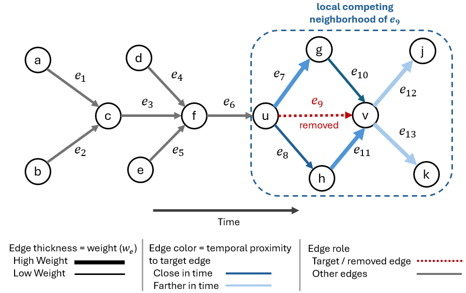

# TRicci: Temporal Ricci-Based Edge Sparsification for Dynamic Graph Learning

This repository contains the implementation of **TRicci**, a Temporal Forman–Ricci curvature-based edge sparsification framework for dynamic graph learning.

TRicci assigns an importance score to each directed, weighted, temporal edge by combining structural support, temporal proximity, and local interaction competition. The goal is to construct compact temporal graph representations that preserve downstream predictive performance while substantially reducing graph size and runtime.

## Overview

The framework processes temporal graphs as sequences of snapshots, computes TRicci scores for edges within each snapshot, ranks edges based on their curvature values, and retains the most informative curvature-ranked edges for downstream prediction.

The method is evaluated on graph-level temporal prediction tasks, including:

- Network activity growth prediction
- Network participation expansion prediction
- Influential node turnover prediction

Experiments are conducted on blockchain transaction networks and TGBL benchmark datasets.

## Key Features

- Temporal Forman–Ricci curvature computation for directed, weighted temporal graphs
- Snapshot-level edge scoring and ranking
- Curvature-based edge sparsification
- Tau sensitivity analysis
- RNN-based temporal prediction using LSTM/GRU models
- ROC-AUC and runtime evaluation against baseline sparsification methods

## Analysis of Curvature Scores in a Local Neighborhood

To examine the behavior of curvature-based edge scoring in a local temporal neighborhood, the figure below presents a directed transaction subgraph with assigned edge weights and relative temporal positions. The highlighted edge $e_9$ is the target interaction selected for curvature analysis.

Edge color intensity indicates temporal proximity relative to the target edge: darker edges represent interactions occurring closer in time to $e_9$, while lighter edges represent more temporally distant interactions. The temporal encoding is therefore defined relative to the inspected edge rather than as a globally ordered timestamp axis.

  

  <em>Local temporal neighborhood used to analyze the curvature of the highlighted target edge e₉.</em>

The following table reports both the proposed TRicci scores and the standard weighted Forman–Ricci curvature (FRC) scores for the edges in the local neighborhood.

<table align="center">
  <thead>
    <tr>
      <th>Edge</th>
      <th>Date</th>
      <th>Weight (we)</th>
      <th>FRC</th>
      <th>TRicci</th>
    </tr>
  </thead>
  <tbody>
    <tr><td>e6</td><td>Jan. 1</td><td>0.144</td><td>-1.004</td><td>1.276</td></tr>
    <tr><td>e7</td><td>Jan. 3</td><td>0.265</td><td>-2.200</td><td>0.914</td></tr>
    <tr><td>e8</td><td>Jan. 4</td><td>0.229</td><td>-1.839</td><td>0.714</td></tr>
    <tr>
      <td><strong>e9</strong></td>
      <td><strong>Jan. 5</strong></td>
      <td><strong>0.225</strong></td>
      <td><strong>-5.331</strong></td>
      <td><strong>0.496</strong></td>
    </tr>
    <tr><td>e10</td><td>Jan. 6</td><td>0.238</td><td>-3.610</td><td>0.828</td></tr>
    <tr><td>e11</td><td>Jan. 7</td><td>0.292</td><td>-4.373</td><td>0.919</td></tr>
    <tr><td>e12</td><td>Jan. 8</td><td>0.281</td><td>-3.894</td><td>1.280</td></tr>
    <tr><td>e13</td><td>Jan. 9</td><td>0.252</td><td>-3.565</td><td>1.252</td></tr>
  </tbody>
</table>

In this example, the target edge $e_9$ receives the lowest score under both formulations. This indicates that it is weakly supported relative to the surrounding interactions and is therefore a natural candidate for removal.

However, this agreement should not be interpreted as a general property of the two methods. Standard weighted FRC evaluates only weighted local topology and does not explicitly model temporal proximity or directed temporal competition. In contrast, TRicci incorporates relative temporal distance and competition among outgoing neighboring edges into the scoring process. Consequently, the two formulations may rank edges differently in more complex temporal settings, where strong static connectivity does not necessarily imply strong temporal relevance.
